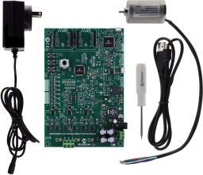
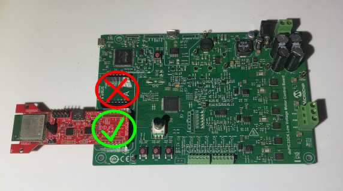
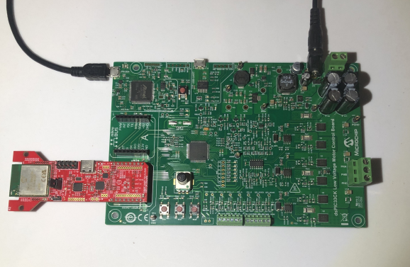
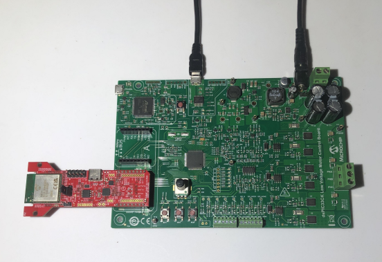

# dsPIC33CK256MP508 Motor Control Starter Kit + RNWF11 /IOTCONNECT Quickstart

A baremetal C quickstart connecting the Microchip **dsPIC33CK256MP508** (on
the **dsPIC33CK Motor Control Starter Kit**, running Microchip's AN957 BLDC
motor-control reference application - see
[`docs/AN957 Demo ReadMe MCSK.pdf`](firmware/dspic33ck256mp508_rnwf11_iotconnect.X/docs))
to [Avnet /IOTCONNECT](https://www.iotconnect.io/) using /IOTCONNECT's
[C SDK](https://github.com/avnet-iotconnect/iotc-c-lib), over the same
Microchip **RNWF11 UART to Cloud Add-on Board** used in the
[dsPIC33AK512MPS512 Curiosity quickstart](https://github.com/avnet-iotconnect/iotc-mchp-dspic33)
this repo is branched from. No RTOS, no MQTT/TLS stack on the MCU - the
RNWF11 owns the WiFi/MQTT/TLS connection itself, using a certificate and key
stored on its own filesystem, and the dsPIC33 just talks to it over UART
with AT commands. While the motor control loop runs in real time, the demo
publishes a motor-state telemetry reading to /IOTCONNECT every 10 seconds.



> [!IMPORTANT]
> **This branch works differently than the main dsPIC33AK512MPS512 quickstart
> in one important way: there's no pre-built firmware image, and no runtime
> WiFi/IoTConnect provisioning over serial.** WiFi credentials and IoTConnect
> connection details are compiled into the firmware as `#define`s, so
> **building from source with MPLAB X is required for everyone** running
> this quickstart, not just people modifying the firmware, and reconfiguring
> for a new WiFi network or a new device means editing a header and
> rebuilding, not re-running a script. See [Why is this different from the
> main branch?](#why-is-this-different-from-the-main-branch) below if you're
> wondering why.

## Table of Contents

1. [Prerequisites](#1-prerequisites)
2. [Get the Quickstart Source](#2-get-the-quickstart-source)
3. [Import the Device Template](#3-import-the-device-template)
4. [Generate and Upload the Device Certificate](#4-generate-and-upload-the-device-certificate)
5. [Create the Device in /IOTCONNECT](#5-create-the-device-in-iotconnect)
6. [Mount the RNWF11 on the Starter Kit](#6-mount-the-rnwf11-on-the-starter-kit)
7. [Resolve Your Device's Connection Info](#7-resolve-your-devices-connection-info)
8. [Configure and Build the Firmware](#8-configure-and-build-the-firmware)
9. [Flash and Run the Demo](#9-flash-and-run-the-demo)
10. [Resources](#10-resources)

The steps below are in the order you actually need to do them: the device
certificate has to exist before you can create the device in /IOTCONNECT,
the RNWF11 has to be provisioned with that certificate before it's mounted
on the starter kit, and your device's resolved connection info has to exist
before you can put it into the firmware and build.

## 1. Prerequisites

### Hardware

1. dsPIC33CK Motor Control Starter Kit **(TODO: correct product/purchase link - placeholder below is not real)**
   [placeholder link](https://www.microchip.com/en-us/development-tool/)

   **TODO: photo of the starter kit board goes here.**

2. [RNWF11 UART to Cloud Add-on Board (EV12H55A)](https://www.microchip.com/en-us/development-tool/ev12h55a)
3. Two USB cables: one for the starter kit's onboard debugger/console, one for the RNWF11's own USB-C port (used only during provisioning)
4. A 2.4 GHz WiFi network and its credentials
5. **TODO:** any motor/power hardware needed to run the BLDC demo itself (motor, power supply, etc.) - see the AN957 PDF

### Software

1. [MPLAB X IDE](https://www.microchip.com/mplabx) 6.25 or later, with the **XC-DSC** compiler (4.00 or later) and the `dsPIC33CK-MP_DFP` device pack - **required for everyone**, not just for modifying the firmware (see the important note above)
2. `openssl` on your `PATH` (already present on most Linux/macOS systems; on Windows it's included with [Git for Windows](https://git-scm.com/downloads/win), among other sources)
3. Either Python 3.9+ **or** PowerShell 5.1+ (Windows ships this by default; PowerShell 7+ also works on Linux/macOS) to run the provisioning scripts - pick whichever you're more comfortable with, both do the same thing
4. A serial terminal (PuTTY, Tera Term, MPLAB Data Visualizer's terminal, etc.) to watch the device's console output
5. An [/IOTCONNECT](https://www.iotconnect.io/) account

> [!NOTE]
> This project pins `dsPIC33CK-MP_DFP` 1.15.423 in
> `firmware/dspic33ck256mp508_rnwf11_iotconnect.X/bldc.X/nbproject/configurations.xml`.
> If your installed pack is a different version, MPLAB X will prompt to
> resolve it on first open - accepting the update (or editing that pinned
> version to match what you have installed) is normally enough.

## 2. Get the Quickstart Source

Unlike the main branch, this one can't be used as just a handful of
downloaded files - the firmware has to be built from source, so clone the
repository and check out this branch:

```bash
git clone https://github.com/avnet-iotconnect/iotc-mchp-dspic33.git
cd iotc-mchp-dspic33
git checkout dspic33ck_mc_starter_kit
git submodule update --init --recursive
```

The `tools/` scripts you'll use in the next few steps are the same ones the
main branch uses - see [tools/](tools/).

## 3. Import the Device Template

<!-- TODO: this branch doesn't have its own device template yet. The main
     branch's templates/dspic33-rnwf11-quickstart-template.json defines a
     single "random" number field, which doesn't match this board's
     telemetry - it publishes these fields instead (see
     iotconnect/iotconnect_rnwf11.c's IOTC_RNWF11_PublishMotorState()):
       run (motor running flag), st (state), sec (commutation sector),
       rpm (requested speed), spd (measured speed), ic (requested current),
       im (measured current), duty (PWM duty cycle), vdc (DC bus voltage)
     Either build a new template in the /IOTCONNECT console with these as
     the data point fields, then export/commit it as e.g.
     templates/dspic33ck-mc-rnwf11-quickstart-template.json, or reuse the
     existing template and just accept that these fields show up as
     unmapped attributes. Once decided, update Step 5's template-select.png
     reference too. -->

> [!NOTE]
> This branch doesn't have its own device template yet - the steps below
> import the main branch's
> [`templates/dspic33-rnwf11-quickstart-template.json`](templates/dspic33-rnwf11-quickstart-template.json)
> as a starting point; its fields just won't match this board's telemetry
> (see the comment in this section's source for what a proper one needs).

1. Log in at [console.iotconnect.io](https://console.iotconnect.io).
2. Open the **Device** module:

   

3. At the bottom of the page, click **Templates**:

   

4. Click **Create Template**:

   

5. Click **Import**, and select
   [`templates/dspic33-rnwf11-quickstart-template.json`](templates/dspic33-rnwf11-quickstart-template.json)
   from the repo you cloned in Step 2:

   

## 4. Generate and Upload the Device Certificate

The RNWF11 board has its own USB-C port and power-select jumper
(`PC3V3` / `HOST3V3`), independent of the starter kit - this step uses it
standalone, **not** mounted on the starter kit yet.

Move the jumper to **PC3V3** and plug the RNWF11's USB-C port directly into
your PC.

<table>
  <tr>
    <td align="center"><br><b>PC3V3</b> - flashing/provisioning (this step)</td>
    <td align="center"><br><b>HOST3V3</b> - normal operation (Step 6)</td>
  </tr>
</table>

**Before running the command below**, find the serial port name it just
enumerated as - **the full path/name, not just the last part** (e.g.
`/dev/ttyACM0`, not `ttyACM0`):
- **Linux**: run `ls /dev/serial/by-id/` (or `dmesg | tail` right after
  plugging it in) - look for the RNWF11's MCP2200 USB-to-UART bridge, e.g.
  `/dev/ttyACM0`.
- **macOS**: run `ls /dev/cu.*` - look for something like `/dev/cu.usbmodemXXXX`.
- **Windows**: open Device Manager &rarr; **Ports (COM & LPT)** - look for
  "MCP2200 USB Serial Port Emulator" and note its `COMx` number (e.g. `COM6`).

The command below downloads [Amazon Root CA 1](https://www.amazontrust.com/repository/AmazonRootCA1.pem)
for you, which is the right CA cert if your IoTConnect account is AWS-backed
(the common case). If your account is Azure-backed instead, download your
own CA cert first and replace `AmazonRootCA1.pem`/`-CaCertPath` with its path.

This board's firmware expects the same default filenames on the RNWF11's
own filesystem as the main branch (`root-ca` / `device-cert` / `device-key`,
set in `iotconnect/iotconnect_rnwf11_config.h`), so the `--ca-name`/
`--cert-name`/`--key-name` flags can stay at their defaults.

Then, in the command below, replace `MYPORTNAME` with the port you just
found, and `MYUNIQUEID` with a Unique ID of your own choosing for this
device - pick something memorable, e.g. `my-desk-dspic33ck`. You'll reuse
whatever you pick later, both when creating the device in IoTConnect and
when resolving connection info. From the `iotc-mchp-dspic33` directory you
cloned:

**Linux/macOS:**
```bash
cd tools
curl -fsSLO https://www.amazontrust.com/repository/AmazonRootCA1.pem
python3 provision_rnwf11_cert.py --port MYPORTNAME --duid MYUNIQUEID \
    --ca-cert-path AmazonRootCA1.pem
cd ..
```

**Windows (PowerShell):**
```powershell
Set-Location tools
Invoke-WebRequest https://www.amazontrust.com/repository/AmazonRootCA1.pem -OutFile AmazonRootCA1.pem
.\provision_rnwf11_cert.ps1 -Port MYPORTNAME -Duid MYUNIQUEID `
    -CaCertPath AmazonRootCA1.pem
Set-Location ..
```

> [!NOTE]
> If you've changed `IOTC_RNWF11_CA_NAME`/`IOTC_RNWF11_CERT_NAME`/
> `IOTC_RNWF11_KEY_NAME` in `iotconnect/iotconnect_rnwf11_config.h` from
> their defaults, pass matching `--ca-name`/`--cert-name`/`--key-name`
> flags here too.

This generates a self-signed device certificate, prints it to the terminal,
and uploads the CA cert, device cert, and device key to the RNWF11's own
filesystem via `AT+FS`. Keep the terminal output around - you'll paste the
printed certificate into the IoTConnect console in the next step.

> [!NOTE]
> This takes 30-60 seconds to finish (three separate file uploads over a
> serial connection) - it hasn't hung if it sits there for a bit.

## 5. Create the Device in /IOTCONNECT

1. After logging into your /IOTCONNECT account on
   [console.iotconnect.io](https://console.iotconnect.io), go to the
   **Device** page and click **Create Device**:

   

2. Set the Unique ID and Device Name:

   

   - **Unique ID**: must be the **exact same** `MYUNIQUEID` value you passed
     to `provision_rnwf11_cert.py`/`.ps1` earlier - this is the DUID and
     it's what ties everything together.
   - **Device Name**: a separate display name shown in the
     /IOTCONNECT console with looser character constraints (e.g. can use spaces)

3. Select your **Entity**:

   

4. Select the template you imported earlier (see the note in
   [Step 3](#3-import-the-device-template) - this screenshot is from the
   main branch and needs updating once this board has its own template):

   

5. Under **Device certificate**, choose **Use my certificate**, and paste
   the certificate PEM that `provision_rnwf11_cert.py`/`.ps1` printed:

   

6. Click **Save & View**.

## 6. Mount the RNWF11 on the Starter Kit

Move the RNWF11's power jumper back to **HOST3V3**.

> [!IMPORTANT]
> **This is the opposite of the main branch's instructions**: on this board,
> the RNWF11 goes in **mikroBUS/Click socket B**, not A. Per
> `iotconnect/iotconnect_rnwf11_config.h`: *"UART2 is routed to the mikroBUS
> B header, where the RNWF11 is seated."* If you're used to the main
> branch's board, double check the socket before mounting it.



## 7. Resolve Your Device's Connection Info

Unlike the main branch, this board has no serial provisioning protocol -
WiFi and IoTConnect connection details go directly into a header file and
get compiled in. This step just resolves what those values need to be.

`provision_device_config.py`/`.ps1` prints your device's resolved MQTT
broker host, client ID, username, and telemetry topic *before* it tries to
open a serial connection - so you can run it with a placeholder `--port`
(or `-Port`) purely to get those printed values, then ignore the "could not
open port" failure that follows. Replace `MYCPID`/`MYENVIRONMENT` with the
values under **Settings &rarr; Key Vault** in the IoTConnect console, and
`MYUNIQUEID` with the same Unique ID you used in Steps 4 and 5:

**Linux/macOS:**
```bash
cd tools
python3 provision_device_config.py --port none --wifi-ssid x --wifi-password x \
    --cpid MYCPID --env MYENVIRONMENT --duid MYUNIQUEID
cd ..
```

**Windows (PowerShell):**
```powershell
Set-Location tools
.\provision_device_config.ps1 -Port none -WifiSsid x -WifiPassword x `
    -Cpid MYCPID -Env MYENVIRONMENT -Duid MYUNIQUEID
Set-Location ..
```

Note the four lines it prints: **Resolved broker host**, **Resolved MQTT
client ID**, **Resolved MQTT username**, and **Resolved telemetry topic** -
you'll copy these into the firmware in the next step.

## 8. Configure and Build the Firmware

Open
[`iotconnect/iotconnect_rnwf11_config.h`](firmware/dspic33ck256mp508_rnwf11_iotconnect.X/iotconnect/iotconnect_rnwf11_config.h)
and fill in:

- `IOTC_WIFI_SSID` / `IOTC_WIFI_PASSWORD` - your WiFi credentials
- `IOTC_MQTT_BROKER_HOST` - the **Resolved broker host** value from Step 7
- `IOTC_MQTT_CLIENT_ID` - the **Resolved MQTT client ID** value (not
  necessarily your raw `MYUNIQUEID` - IoTConnect assigns a different client
  ID on some account types, which is why this step resolves it instead of
  guessing)
- `IOTC_MQTT_USERNAME` - the **Resolved MQTT username** value (likely empty
  for an AWS-backed account, which authenticates by certificate instead)
- `IOTC_MQTT_TELEMETRY_TOPIC` - the **Resolved telemetry topic** value

Leave `IOTC_RNWF11_CA_NAME` / `IOTC_RNWF11_CERT_NAME` / `IOTC_RNWF11_KEY_NAME`
at their defaults (`root-ca` / `device-cert` / `device-key`) unless you
passed different names in Step 4.

Then, in MPLAB X:

1. Open [`firmware/dspic33ck256mp508_rnwf11_iotconnect.X/bldc.X`](firmware/dspic33ck256mp508_rnwf11_iotconnect.X/bldc.X).
2. Clean and Build. The output `.hex` lands in
   `bldc.X/dist/default/production/`.

> [!NOTE]
> **Every new WiFi network or every new device means repeating this step** -
> edit the header, rebuild, reflash. There's no way around the recompile on
> this board; see [Why is this different from the main branch?](#why-is-this-different-from-the-main-branch).

## 9. Flash and Run the Demo

Connect the board's power supply, and connect the included micro-USB cable
between your PC and the board's **PKOB4** port. The RNWF11 stays mounted
from Step 6.



Program the board via the onboard debugger (**Make and Program Device** in
MPLAB X).

To watch the boot log, open a serial terminal at 115200 8-N-1 - but first
move the micro-USB cable from the **PKOB4** port to the board's
**USB-UART** port instead (the debug console isn't available over PKOB4):



Once connected, the firmware publishes motor-state telemetry to
/IOTCONNECT every 10 seconds:

```json
{"run": 0, "st": 0, "sec": 0, "rpm": 0, "spd": 0, "ic": 0, "im": 0, "duty": 0, "vdc": 0}
```

(`run`=motor running flag, `st`=state, `sec`=commutation sector,
`rpm`=requested speed, `spd`=measured speed, `ic`=requested current,
`im`=measured current, `duty`=PWM duty cycle, `vdc`=DC bus voltage.)

Watch it arrive on the device's **Live Data** tab in the /IOTCONNECT console.

<!-- TODO: screenshot of the Live Data tab showing this board's telemetry,
     once a device template that maps these fields exists (see Step 3). -->
**TODO: screenshot of the Live Data tab goes here** (once this board has its
own device template, see Step 3).

<!-- TODO: instructions for actually running the BLDC motor demo itself
     (motor/power hookup, any switches or buttons) - see the AN957 PDF. -->
**TODO: instructions for actually running the BLDC motor demo itself**
(motor/power hookup, any switches or buttons - see the AN957 PDF) go here.

## 10. Resources

- [AN957 Demo ReadMe MCSK.pdf](firmware/dspic33ck256mp508_rnwf11_iotconnect.X/docs) - Microchip's motor-control reference application this quickstart is built on
- [Main branch README](https://github.com/avnet-iotconnect/iotc-mchp-dspic33/blob/main/README.md) - the dsPIC33AK512MPS512 Curiosity board quickstart this one is branched from
- [RNWF11 UART to Cloud Add-on Board User's Guide](https://ww1.microchip.com/downloads/aemDocuments/documents/WSG/ProductDocuments/UserGuides/RNWF11-UART-to-Cloud-Add-on-Board-User-Guide-DS50003638.pdf)
- [RNWF11 Application Developer's Guide](https://onlinedocs.microchip.com/oxy/GUID-209426F5-2F78-4B3F-80A0-AD79A119381E) (AT command reference)
- [iotc-c-lib](https://github.com/avnet-iotconnect/iotc-c-lib) - /IOTCONNECT's C SDK

### Why is this different from the main branch?

The main branch stores WiFi/IoTConnect config in a reserved flash page,
written at runtime over serial by a provisioning script - so one prebuilt
`.hex` works for anyone, and reconfiguring never needs a recompile. That
depends on a flash driver written for the dsPIC33AK's flash controller,
which doesn't carry over to this dsPIC33CK-family board's more traditional
flash peripheral, and this board's UART budget is already tighter (shared
with the real-time motor-control loop) than the main board's. Building that
same runtime-provisioning support here is possible but nontrivial - see the
main branch's `bsp/nvm_flash.c` and `app/provisioning.c` for what it would
involve porting. Until/unless someone does that work, this board uses
compile-time configuration instead.
