# dsPIC33AK512MPS512 + RNWF11 /IOTCONNECT Quickstart

A baremetal C quickstart connecting the Microchip **dsPIC33AK512MPS512** (on the
**dsPIC33 Curiosity Platform Development Board**) to
[Avnet /IOTCONNECT](https://www.iotconnect.io/) using /IOTCONNECT's
[C SDK](https://github.com/avnet-iotconnect/iotc-c-lib), over a Microchip
**RNWF11 UART to Cloud Add-on Board**. No RTOS, no MQTT/TLS stack on the MCU -
the RNWF11 owns the WiFi/MQTT/TLS connection itself, using a certificate and
key stored on its own filesystem, and the dsPIC33 just talks to it over UART
with AT commands. The demo sends one random-number telemetry value to
/IOTCONNECT every 10 seconds.

<table>
  <tr>
    <td>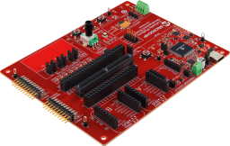</td>
    <td>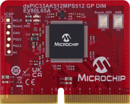</td>
  </tr>
</table>

## Table of Contents

1. [Prerequisites](#1-prerequisites)
2. [Download the Quickstart Files](#2-download-the-quickstart-files)
3. [Import the Device Template](#3-import-the-device-template)
4. [Generate and Upload the Device Certificate](#4-generate-and-upload-the-device-certificate)
5. [Create the Device in /IOTCONNECT](#5-create-the-device-in-iotconnect)
6. [Mount the RNWF11 on the Curiosity Board](#6-mount-the-rnwf11-on-the-curiosity-board)
7. [Flash the Firmware](#7-flash-the-firmware)
8. [Provision WiFi and /IOTCONNECT Config](#8-provision-wifi-and-iotconnect-config)
9. [Running the Demo](#9-running-the-demo)
10. [Resources](#10-resources)

The steps below are in the order you actually need to do them: the device
certificate has to exist before you can create the device in /IOTCONNECT, the
RNWF11 has to be provisioned with that certificate before it's mounted on
the Curiosity board, and the firmware has to already be flashed and running
before the final config-provisioning step can talk to it.

## 1. Prerequisites

### Hardware

1. [dsPIC33 Curiosity Platform Development Board](https://www.microchip.com/en-us/development-tool/ev74h48a) with the dsPIC33AK512MPS512 General Purpose DIM installed

   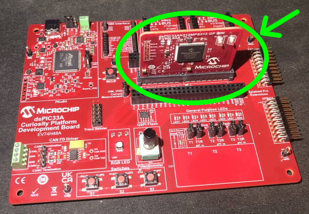

2. [RNWF11 UART to Cloud Add-on Board (EV12H55A)](https://www.microchip.com/en-us/development-tool/ev12h55a)
3. Two USB cables: one for the Curiosity board's onboard debugger/console, one for the RNWF11's own USB-C port (used only during provisioning)
4. A 2.4 GHz WiFi network and its credentials

### Software

1. [MPLAB IPE](https://www.microchip.com/mplab/mplab-integrated-programming-environment) (or MPLAB X IDE, which includes it) to flash the pre-built firmware image in [`bin/`](bin/) via the onboard PKOB4 debugger. You only need the full MPLAB X IDE if you're building from source - see [developer.md](developer.md).
2. `openssl` on your `PATH` (already present on most Linux/macOS systems; on Windows it's included with [Git for Windows](https://git-scm.com/downloads/win), among other sources)
3. Either Python 3.9+ **or** PowerShell 5.1+ (Windows ships this by default; PowerShell 7+ also works on Linux/macOS) to run the provisioning scripts - pick whichever you're more comfortable with, both do the same thing
4. A serial terminal (PuTTY, Tera Term, MPLAB Data Visualizer's terminal, etc.) to watch the device's console output
5. An [/IOTCONNECT](https://www.iotconnect.io/) account

## 2. Download the Quickstart Files

You don't need to clone this repository - download just the files this
quickstart uses. Pick the block matching your provisioning script choice
(Python or PowerShell) from [Prerequisites](#1-prerequisites):

### Linux/macOS (bash), Python scripts:

```bash
mkdir dspic33-rnwf11-quickstart && cd dspic33-rnwf11-quickstart
RAW=https://raw.githubusercontent.com/avnet-iotconnect/iotc-mchp-dspic33/main
curl -fsSLO "$RAW/templates/dspic33-rnwf11-quickstart-template.json"
mkdir bin && curl -fsSL -o bin/dspic33ak512mps512_rnwf11_iotconnect.hex "$RAW/bin/dspic33ak512mps512_rnwf11_iotconnect.hex"
mkdir tools && cd tools
curl -fsSLO "$RAW/tools/provision_rnwf11_cert.py"
curl -fsSLO "$RAW/tools/provision_device_config.py"
curl -fsSLO "$RAW/tools/requirements.txt"
pip install -r requirements.txt 2>/dev/null || pip install --break-system-packages -r requirements.txt
cd ..
```

> [!NOTE]
> On newer Debian/Ubuntu systems, plain `pip install` may refuse with an
> "externally-managed-environment" error (PEP 668) - the `--break-system-packages`
> fallback above handles that. If you'd rather not touch the system Python at
> all, use a virtual environment instead: `python3 -m venv venv && source venv/bin/activate && pip install -r requirements.txt`.

### Windows (PowerShell), PowerShell scripts:

```powershell
New-Item -ItemType Directory dspic33-rnwf11-quickstart | Out-Null
Set-Location dspic33-rnwf11-quickstart
$Raw = "https://raw.githubusercontent.com/avnet-iotconnect/iotc-mchp-dspic33/main"
Invoke-WebRequest "$Raw/templates/dspic33-rnwf11-quickstart-template.json" -OutFile dspic33-rnwf11-quickstart-template.json
New-Item -ItemType Directory bin | Out-Null
Invoke-WebRequest "$Raw/bin/dspic33ak512mps512_rnwf11_iotconnect.hex" -OutFile bin/dspic33ak512mps512_rnwf11_iotconnect.hex
New-Item -ItemType Directory tools | Out-Null
Set-Location tools
Invoke-WebRequest "$Raw/tools/provision_rnwf11_cert.ps1" -OutFile provision_rnwf11_cert.ps1
Invoke-WebRequest "$Raw/tools/provision_device_config.ps1" -OutFile provision_device_config.ps1
Set-Location ..
```

The rest of this README refers to files by these same relative paths
(`templates/...`, `bin/...`, `tools/...`), whether you downloaded them
individually or cloned the repo.

## 3. Import the Device Template

1. Log in at [console.iotconnect.io](https://console.iotconnect.io).
2. Open the **Device** module:

   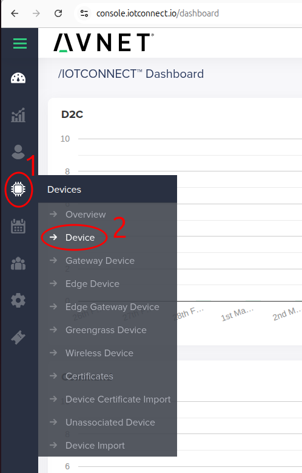

3. At the bottom of the page, click **Templates**:

   

4. Click **Create Template**:

   

5. Click **Import**, and select the **`dspic33-rnwf11-quickstart-template.json`** file you downloaded in Step 2:

   

## 4. Generate and Upload the Device Certificate

The RNWF11 board has its own USB-C port and power-select jumper
(`PC3V3` / `HOST3V3`), independent of the Curiosity board - this step uses it
standalone, **not** mounted on the Curiosity board yet.

Move the jumper to **PC3V3** and plug the RNWF11's USB-C port directly into
your PC.

<table>
  <tr>
    <td align="center">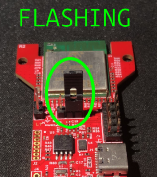<br><b>PC3V3</b> - flashing/provisioning (this step)</td>
    <td align="center">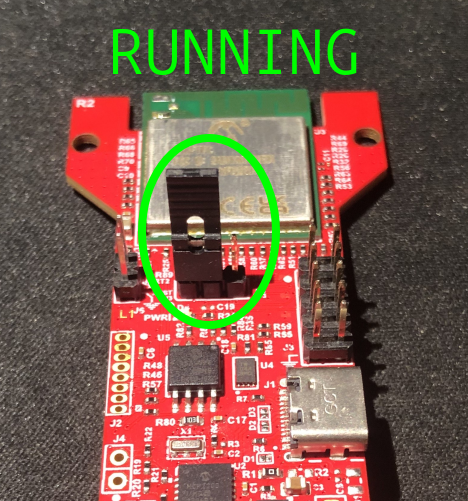<br><b>HOST3V3</b> - normal operation (Step 6)</td>
  </tr>
</table>

**Before running the command below**, find the serial port name it just
enumerated as - **the full path/name, not just the last part** (e.g.
`/dev/ttyACM0`, not `ttyACM0`):
- **Linux**: run `ls /dev/serial/by-id/` (or `dmesg | tail` right after
  plugging it in) - look for the RNWF11's MCP2200 USB-to-UART bridge, e.g.
  `/dev/ttyACM0`.
- **macOS**: run `ls /dev/cu.*` - look for something like `/dev/cu.usbmodemXXXX`.
- **Windows**: open Device Manager &rarr; **Ports (COM & LPT)** - look for
  "MCP2200 USB Serial Port Emulator" and note its `COMx` number (e.g. `COM6`).

The command below downloads [Amazon Root CA 1](https://www.amazontrust.com/repository/AmazonRootCA1.pem)
for you, which is the right CA cert if your IoTConnect account is AWS-backed
(the common case). If your account is Azure-backed instead, download your
own CA cert first and replace `AmazonRootCA1.pem`/`-CaCertPath` with its path.

Then, in the command below, replace `MYDEVICENAME` with the port you just
found, and `MYUNIQUEID` with a Unique ID of your own choosing for this
device - pick something memorable, e.g. `my-desk-dspic33`. You'll reuse
whatever you pick later, both when creating the device in IoTConnect and
when provisioning WiFi/IoTConnect config, so make a note of it. From the
`dspic33-rnwf11-quickstart` directory you downloaded the files into:

**Linux/macOS:**
```bash
cd tools
curl -fsSLO https://www.amazontrust.com/repository/AmazonRootCA1.pem
python3 provision_rnwf11_cert.py --port MYDEVICENAME --duid MYUNIQUEID \
    --ca-cert-path AmazonRootCA1.pem
cd ..
```

**Windows (PowerShell):**
```powershell
Set-Location tools
Invoke-WebRequest https://www.amazontrust.com/repository/AmazonRootCA1.pem -OutFile AmazonRootCA1.pem
.\provision_rnwf11_cert.ps1 -Port MYDEVICENAME -Duid MYUNIQUEID `
    -CaCertPath AmazonRootCA1.pem
Set-Location ..
```

This generates a self-signed device certificate, prints it to the terminal,
and uploads the CA cert, device cert, and device key to the RNWF11's own
filesystem via `AT+FS`. Keep the terminal output around - you'll paste the
printed certificate into the IoTConnect console in the next step.

> [!NOTE]
> This takes 30-60 seconds to finish (three separate file uploads over a
> serial connection) - it hasn't hung if it sits there for a bit.

## 5. Create the Device in /IOTCONNECT

1. After logging into your /IOTCONNECT account on
   [console.iotconnect.io](https://console.iotconnect.io), go to the
   **Device** page and click **Create Device**:

   

2. Set the Unique ID and Device Name:

   

   - **Unique ID**: must be the **exact same** `MYUNIQUEID` value you passed
     to `provision_rnwf11_cert.py`/`.ps1` earlier - this is the DUID and
     it's what ties everything together.
   - **Device Name**: a separate display name shown in the
     /IOTCONNECT console with looser character constraints (e.g. can use spaces)

3. Select your **Entity**:

   

4. Select the template you imported earlier:

   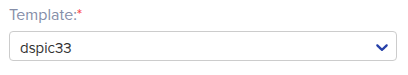

5. Under **Device certificate**, choose **Use my certificate**, and paste
   the certificate PEM that `provision_rnwf11_cert.py`/`.ps1` printed:

   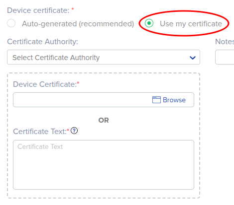

6. Click **Save & View**.

## 6. Mount the RNWF11 on the Curiosity Board

Move the RNWF11's power jumper back to **HOST3V3**, then mount it on the
Curiosity board's **mikroBUS A** socket specifically - this firmware is wired
for that socket (UART2 on RP72/RP73, mapped via Peripheral Pin Select in
`mcc_generated_files/system/src/pins.c`).

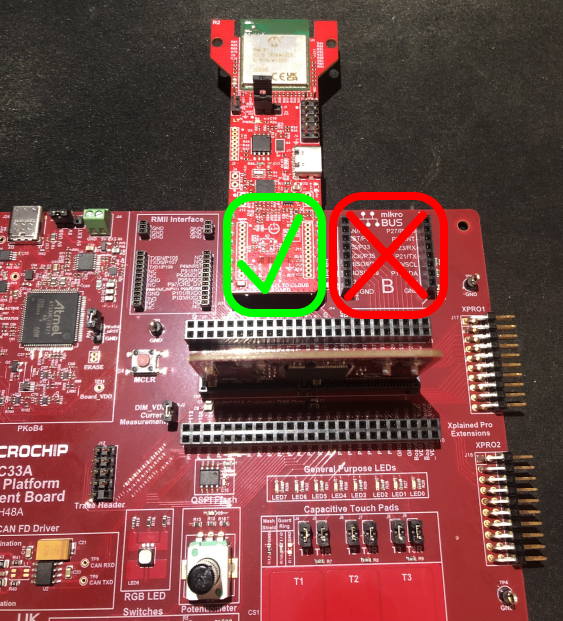

> [!IMPORTANT]
> It must go in **mikroBUS A**, not mikroBUS B - the demo will not work if
> it's installed in mikroBUS B, since the firmware only routes UART2 to
> mikroBUS A's pins.

## 7. Flash the Firmware

This quickstart ships a pre-built firmware image at
[`bin/dspic33ak512mps512_rnwf11_iotconnect.hex`](bin/) - you don't need
MPLAB X or to build anything to run the demo.

After opening the MPLAB IPE:

1. Select the **dsPIC33AK512MPS512** device (start typing `dsPIC33AK512...` and the dropdown will narrow down to it)
2. Select the **PKOB4** tool (should be the only option unless you have other Microchip hardware connected).
3. Browse to `bin/dspic33ak512mps512_rnwf11_iotconnect.hex`
4. Click **Connect**
5. Click **Program**

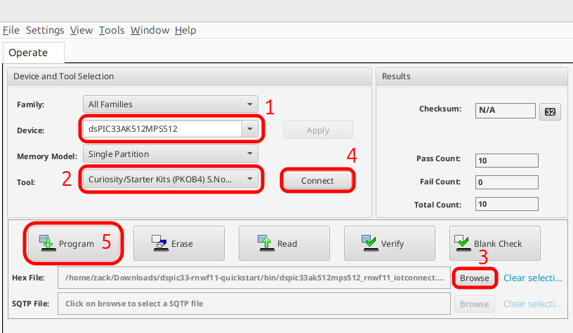

6. Unplug and replug the board's power to make sure the new firmware starts
   running.
7. Open a serial terminal at 115200 8-N-1 to watch the boot log.

> [!TIP]
> **Program** only becomes clickable if you selected the `.hex` file
> *before* clicking **Connect**. If you connected first and it's staying
> grayed out, click **Disconnect** then **Connect** again (no need to
> re-browse for the file) and it should become clickable.

> [!IMPORTANT]
> The Curiosity board's single USB-C cable enumerates **two separate serial
> ports**: one for the PKOB4 programmer/debugger (what MPLAB IPE just used -
> not a text console), and a completely separate one from an onboard
> MCP2221A USB-UART chip, which is the port this firmware's console
> actually goes out on. On Linux/macOS, run `ls /dev/serial/by-id/` and look
> for the entry with "MCP2221" in its name; on Windows, check Device
> Manager for a second `COMx` port distinct from the PKOB4 one. If you open
> the wrong port, you'll see nothing at all.

The firmware will print `Not provisioned yet.` and wait - that's expected
until you complete the next step.

> [!TIP]
> Modifying the firmware, or just want to build it yourself from source?
> See [developer.md](developer.md).

## 8. Provision WiFi and /IOTCONNECT Config

With the firmware running and waiting, push WiFi and IoTConnect config to it
over the same debug console UART.

**Before running the command below**, find the Curiosity board's debug
console port - its onboard **MCP2221A** USB-to-UART chip, not the PKOB4
programmer/debugger port you used in the previous step, and not the
RNWF11's port from earlier still (the single USB-C cable to the Curiosity
board enumerates the PKOB4 and MCP2221A ports separately):
- **Linux**: run `ls /dev/serial/by-id/` (or `dmesg | tail` right after
  plugging the board in) - look for the entry with "MCP2221" in its name,
  e.g. `/dev/ttyACM1`.
- **macOS**: run `ls /dev/cu.*` - look for something like `/dev/cu.usbmodemXXXX`.
- **Windows**: open Device Manager &rarr; **Ports (COM & LPT)** - look for
  "MCP2221 USB-UART Combo" (or similar) and note its `COMx` number.

Then, in the command below, replace: `MYDEVICENAME` with that port;
`MYWIFINETWORK`/`MYWIFIPASSWORD` with your WiFi credentials (kept in quotes
since either may contain spaces); `MYCPID` and `MYENVIRONMENT` with the
values under **Settings &rarr; Key Vault** in the IoTConnect console; and
`MYUNIQUEID` with the **same** Unique ID you used earlier when generating
the certificate and creating the device (not a new one). The cert/key name
options don't need to change unless you changed them from the defaults
earlier. From the `dspic33-rnwf11-quickstart` directory you downloaded the
files into:

**Linux/macOS:**
```bash
cd tools
python3 provision_device_config.py --port MYDEVICENAME \
    --wifi-ssid "MYWIFINETWORK" --wifi-password "MYWIFIPASSWORD" \
    --cpid MYCPID --env MYENVIRONMENT --duid MYUNIQUEID \
    --ca-name root-ca --cert-name device-cert --key-name device-key
cd ..
```

**Windows (PowerShell):**
```powershell
Set-Location tools
.\provision_device_config.ps1 -Port MYDEVICENAME `
    -WifiSsid "MYWIFINETWORK" -WifiPassword "MYWIFIPASSWORD" `
    -Cpid MYCPID -Env MYENVIRONMENT -Duid MYUNIQUEID `
    -CaName root-ca -CertName device-cert -KeyName device-key
Set-Location ..
```

This script resolves your device's actual MQTT broker host, username, and
telemetry topic via /IOTCONNECT's discovery/identity API (using
[`iotconnect-sdk-lite`](https://pypi.org/project/iotconnect-sdk-lite/)'s
public `DeviceRestApi`, the same mechanism the other quickstarts in this
family use - this only succeeds once the device already exists in
/IOTCONNECT, which is why the device has to be created before this step),
then writes everything into the dsPIC33's on-chip flash over its console
UART.

> [!NOTE]
> If the device is already provisioned and busy retrying a WiFi/MQTT
> connection, it can only notice a new provisioning attempt in the brief
> gaps between connection attempts - this script automatically retries the
> handshake every few seconds (up to 90 seconds total) to land in one of
> those gaps, printing `No response yet...` while it does. That's normal,
> not a failure.

## 9. Running the Demo

Once provisioning completes, the device connects to WiFi, then to /IOTCONNECT
over MQTT via the RNWF11, and publishes `{"random": <0-100>}` every 10 seconds.
Watch it arrive on the device's **Live Data** tab in the /IOTCONNECT console.

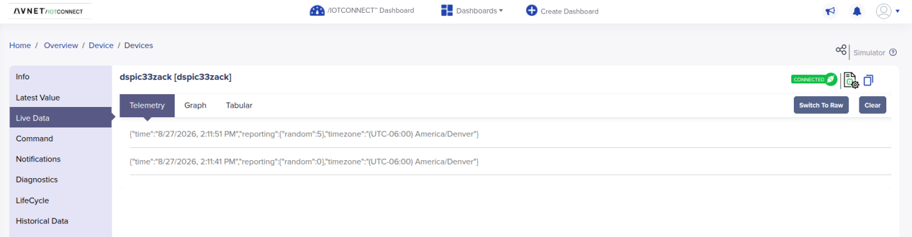

## 10. Resources

- [developer.md](developer.md) - building from source, project architecture, and how to modify the firmware
- [Microchip's dsPIC33A Curiosity OOB Demo](https://github.com/microchip-pic-avr-examples/dspic33a-curiosity-oob)
- [RNWF11 UART to Cloud Add-on Board User's Guide](https://ww1.microchip.com/downloads/aemDocuments/documents/WSG/ProductDocuments/UserGuides/RNWF11-UART-to-Cloud-Add-on-Board-User-Guide-DS50003638.pdf)
- [RNWF11 Application Developer's Guide](https://onlinedocs.microchip.com/oxy/GUID-209426F5-2F78-4B3F-80A0-AD79A119381E) (AT command reference)
- [iotc-c-lib](https://github.com/avnet-iotconnect/iotc-c-lib) - /IOTCONNECT's C SDK
- [iotc-mchp-sama7d65-rnwf11](https://github.com/avnet-iotconnect/iotc-mchp-sama7d65-rnwf11) - another /IOTCONNECT demo using the RNWF11 with Linux host-side TLS instead of on-module
